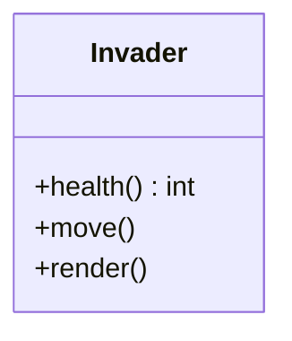
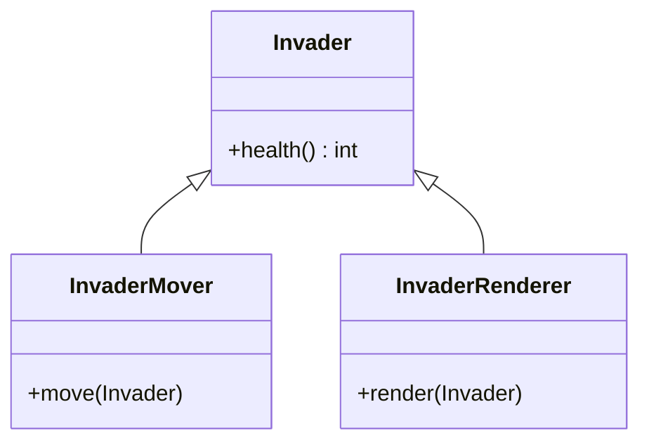
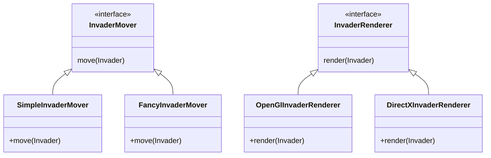

<div class="absolute top-10">
  <span class="font-700">
    Xavier Balloy | <Today />
  </span>
</div>

<div class="absolute bottom-10">
  <h1>SOLID</h1>
  <p>The First 5 Principles of Object Oriented Design Explained</p>
</div>

<!--
- Principles defined by Robert C. Martin (Uncle Bob) in 2000
- Acronym introduced by Michael Feathers
- Apply to any object-oriented design but also software component or microservices
-->

---
layout: image-right
image: /single_responsibility_principle.jpg
backgroundSize: contain
---

# Single Responsibility Principle (SRP)

> There should never be more than one reason for a class to change

- Easier to understand
- Less risk to break unrelated code
- Ask yourself: what is the responsibility of my component?

---

# Single Responsibility Principle
## Example: SRP broken



Several reasons to change:
- change the logic that calculate the health
- move a different way
- change the rendering

---

# Single Responsibility Principle
## Example: SRP fixed



Single reason to change: logic that calculate the health 

---
layout: image-right
image: /openclosed_principle.jpg
backgroundSize: contain
---

# Open/Closed Principle (OCP)

> Software entities ... should be open for extension, but closed for modification.

<mdi-alert /> OCP is **not** about

- locking down your class by using the correct modifiers

OCP is about:
- programming to the superclass/interface
- ensuring that we always refer to abstraction and not concrete implementation

---

# Open/Closed Principle
## Example: OCP broken

```java{4-5}
public final class Invaders {

  private final Collection<Invader> invaders = ...;
  private final SimpleInvaderMover simpleInvaderMover = new SimpleInvaderMover();
  private final OpenGlInvaderRenderer openGlInvaderRenderer = new OpenGlInvaderRenderer();

    ...

  public void mainLoop() {
    for (Invader invader : invaders) {
      simpleInvaderMover.move(invader);
      openGlInvaderRenderer.render(invader);
    }
  }
}
```

- Depending on concrete implementation of `SimpleInvaderMover` and `OpenGlInvaderRenderer`
- If we cannot change them we need to change `Invaders` directly

---

# Open/Closed Principle
## Example: OCP fixed


---

# Open/Closed Principle
## Example: OCP fixed

```java{4-6}
public final class Invaders {

    private Collection<Invader> invaders = ...;
    // See DIP for how these are instantiated
    private InvaderMover invaderMover = ...;       
    private InvaderRenderer invaderRenderer = ...;

    ...

    public void mainLoop() {
        for (Invader invader : invaders) {
            invaderMover.move(invader);
            invaderRenderer.render(invader);
        }
    }
}
```

- Close for modification: no need to modify directly `Invaders`
- Open for extension: we can inject new implementation at runtime

---
layout: image-right
image: /liskov_substitution_principle.jpg
backgroundSize: contain
---

# Liskov Substitution Principle (LSP)

> Functions that use pointers or references to base classes must be able to use objects of derived classes without knowing it.

- Replacing a type by its subtype will not break a program
- Must respect 3 rules:
  - Same methods signatures
  - Same methods conditions
  - Same class properties rules

---
layout: image-right
image: /interface_segregation_principle.jpg
backgroundSize: contain
---

# Interface Segregation Principle (ISP)

> Many client-specific interfaces are better than one general-purpose interface.

- No client should depend on methods it does not use

---

# Interface Segregation Principle
## Example: ISP broken

```java{11,12,16,17}
interface Invader{
    void bomb();
    void swoop();
}

public final class Bomber implements Invader{
    @Override
    public void bomb() {
        dropBombs();
    }
    @Override
    public void swoop() {}
}

public final class Swooper implements Invader{
    @Override
    public void bomb() {}
    @Override
    public void swoop() {
        initiateSwoop();
    }
}
```

---

# Interface Segregation Principle
## Example: ISP fixed

```java
interface BombingInvader {
     void bomb();
 }

 interface SwoopingInvader {
     void swoop();
 }

 public final class Bomber implements BombingInvader {

     @Override
     public void bomb() {
         dropBombs();
     }
 }

 public final class Swooper implements SwoopingInvader {

     @Override
     public void swoop() {
         initiateSwoop();
     }
 }
```

---

# Interface Segregation Principle
## Example: ISP fixed

```java
public final class SwoopingBomber implements SwoopingInvader, BombingInvader {

  @Override
  public void bomb() {
    dropBombs();
  }

  @Override
  public void swoop() {
    initiateSwoop();
  }
}
```

- Better decoupling of classes: easier to refactor, maintain, read

---
layout: image-right
image: /dependency_inversion_principle.jpg
backgroundSize: contain
---

# Dependency Inversion Principle (DIP)

> Depend upon abstractions, [not] concretions.

- Closely tied to Open/Closed Principle
- DIP enables OCP

---

# Dependency Inversion Principle (DIP)
## Example

```java
public final class Invaders {

    private final InvaderMover invaderMover;
    private final InvaderRenderer invaderRenderer;

    public Invaders(InvaderMover invaderMover, InvaderRenderer invaderRenderer) {
        this.invaderMover = invaderMover;
        this.invaderRenderer = invaderRenderer;
    }

    ...

    private final Invaders invaders = new Invaders(
            new SimpleInvaderMover(),
            new OpenGlInvaderRenderer()
    );
}
```

- We use Inversion of Control (IOC) to inject concrete implementations
- You can either do it manually or use Dependency Injection Frameworks

---

# Learn more

- [SOLID Software Principles in Practice](https://www.jkspad.com/solid/solid/)
- [Single Responsibility Principe (PDF)](https://web.archive.org/web/20150202200348/http://www.objectmentor.com/resources/articles/srp.pdf)
- [Open/Closed Principle (PDF)](https://web.archive.org/web/20150905081105/http://www.objectmentor.com/resources/articles/ocp.pdf)
- [Liskov Substitution Principle (PDF)](https://web.archive.org/web/20150905081111/http://www.objectmentor.com/resources/articles/lsp.pdf)
- [Interface Segregation Principle (PDF)](https://web.archive.org/web/20150905081110/http://www.objectmentor.com/resources/articles/isp.pdf)
- [Dependency Inversion Principle (PDF)](https://web.archive.org/web/20150905081103/http://www.objectmentor.com/resources/articles/dip.pdf)
